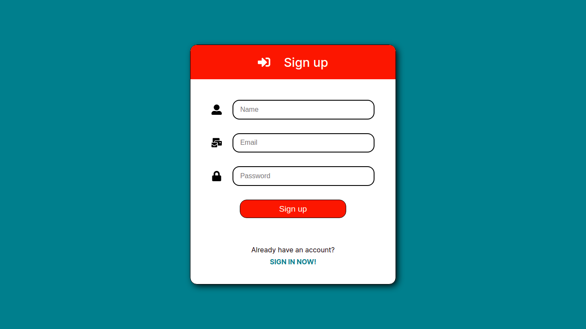
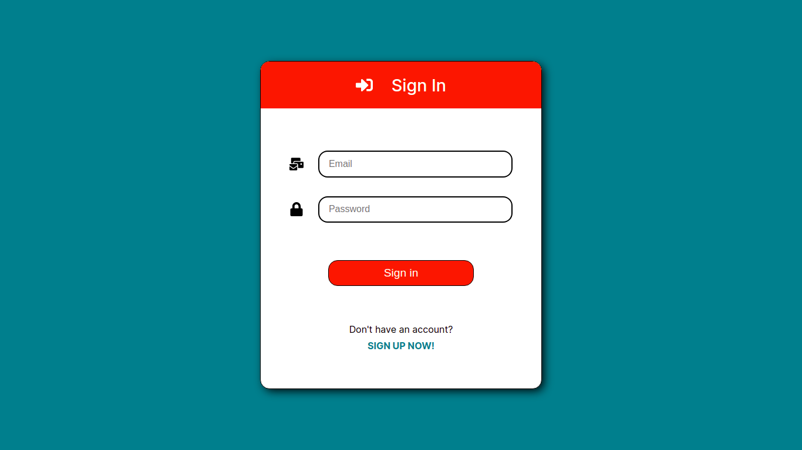

<p align="center">
  <h3 align="center">Login Pages with ReactJS</h3>

  <p align="center">
    A simple login and register pages!
    <br />
    <a href="https://github.com/LucFerSan/login-pages-react"><strong>Explore the docs »</strong></a>
    <br />
    <br />
    ·
    <a href="https://github.com/LucFerSan/login-pages-react/issues">Report Bug</a>
    ·
    <a href="https://github.com/LucFerSan/login-pages-react/issues">Request Feature</a>
  </p>
</p>

## About The Project



This is my first project with react, so I decided to build a simple login and register pages, just for the sake of practicing this technology.

### Built With

- [React](https://reactjs.org/)
- [Styled Components](https://styled-components.com/)
- [React Router Dom](https://reactrouter.com/web/guides/quick-start)

### Installation

1. Clone the repo
   ```sh
   git clone https://github.com/LucFerSan/login-pages-react.git
   ```
2. Install the packages
   ```sh
   cd login-pages-react
   yarn
   ```

## Usage

<p float="left">
  
   
</p>

## Contributing

Contributions are what make the open source community such an amazing place to be learn, inspire, and create. Any contributions you make are **greatly appreciated**.

1. Fork the Project
2. Create your Feature Branch (`git checkout -b feature/AmazingFeature`)
3. Commit your Changes (`git commit -m 'Add some AmazingFeature'`)
4. Push to the Branch (`git push origin feature/AmazingFeature`)
5. Open a Pull Request

## License

Distributed under the MIT License. See `LICENSE` for more information.

## Contact

Lucas Fernandes - fernandes.lucas11@outlook.com

Project Link - live view: [https://react-first-lucas.netlify.app](https://react-first-lucas.netlify.app)
